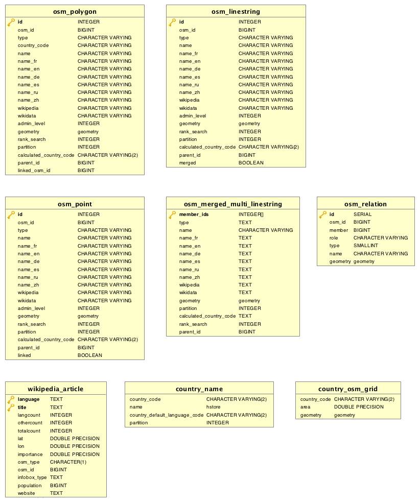

Data Model
==========

The tables in the data model can be categorized in two categories. Helper tables and OSM data tables. The data model looks as follows:

Note that the bottom tables are helper tables and initialized before importing OSM data. The OSM tables are being constructed during the import by imposm3. Note that the osm_id in the OSM tables is not the original osm_id from OpenStreetMap, but rather a special kind where osm_ids of relations are negated in order to prevent collisions with way IDs.
