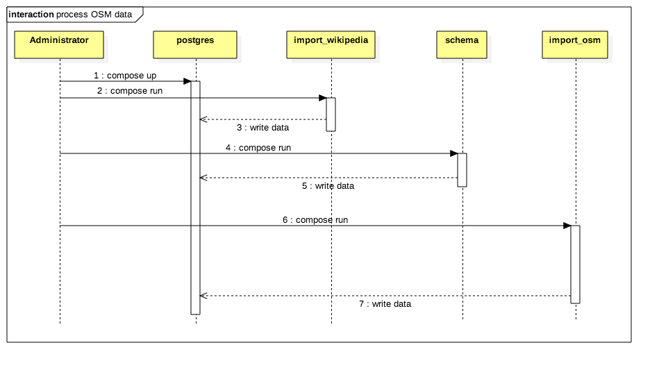
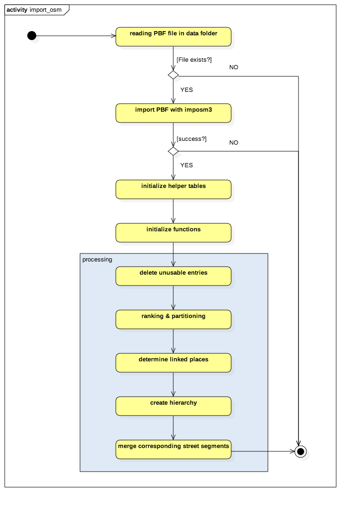
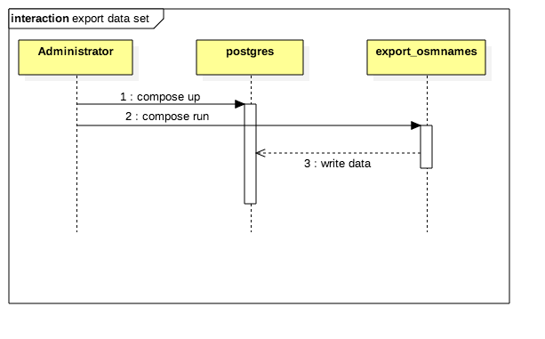

Process of OSMNames
===================

The following descibes the steps involved in the processing of data in OSMNames.

Data Import
-----------

In order to import OSM data the administrator downloads either downloads the pbf file or uses the corresponding docker compose task. The process looks like this:

The essential important import process looks like this:

Data Export
-----------

The data export looks like this:

