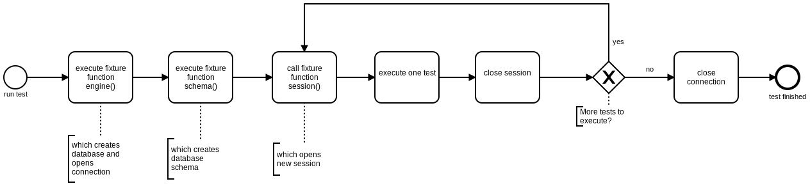
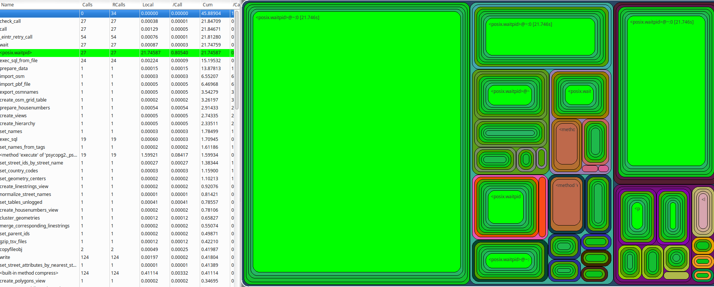

===========
Development
===========

Contributing / Issues
*********************
If you like to contribute feel free to create an issue on the `OSMNames GitHub
repository <https://github.com/OSMNames/OSMNames/issues>`_. It is optimal if the
issue description includes some real examples, like OSM IDs of existing
OpenStreetMap elements. Additionally should each new functionality or bugfix
be covered by a new test case (see `Testing`_).

Keep in mind that the following styleguides should be respected:

* `PEP8 <https://www.python.org/dev/peps/pep-0008/>_` for Python code
* `SQL Style Guide <http://www.sqlstyle.guide/>_` for SQL

Testing
*******
To have a sustainable code base, tests are indispensable. OSMNames uses the
`Python testing framework pytest <https://docs.pytest.org/en/latest/>`_ for
testing.

The tests run inside a docker container and uses the same docker container for
the database, as the main process of OSMNames. To run the tests, following
command can be executed:

.. code-block:: bash

  docker-compose run --rm osmnames bash run_tests.sh

This executes the script `run_tests.sh` inside the docker container.

Alternatively can a path be added as argument to execute a specific test:

.. code-block:: bash

  docker-compose run --rm osmnames bash run_tests.sh tests/prepare_data/test_delete_unusable_entries.py

Some important notes about the architecture of the tests:

* The tests can be found in the directory `tests/`

* The name of the Python test files and the name of the functions must have the
  prefix `test_` to be executed by pytest.

* When including the pytest fixture `session` in a test method, the test
  database is dropped and recreated before the test. The fixture is defined
  `here <https://github.com/OSMNames/OSMNames/blob/master/tests/conftest.py>`_.

* A good way to structure a test, is to import a SQL dump with the necessary
  schema, after the database was recreated by the `session` fixture.

* To create rows in Python code, the `helper class Tables
  <https://github.com/OSMNames/OSMNames/blob/master/osmnames/database/tables.py>`_
  can be used.

**Example for a Test**

The following code tests the functionality of the function
`delete_unusable_entries`. For better understanding are some parts of the file
`conftest.py` also listed.

`tests/conftest.py`:

.. code-block:: python

  # ...

  @pytest.fixture(scope="module")
  def engine():
      wait_for_database()
      _recreate_database()

      yield connection.engine

      connection.engine.dispose()

  @pytest.fixture(scope="function")
  def session(engine):
      session = Session(engine)

      yield session

      session.close()

  @pytest.fixture(scope="module")
  def tables(engine):
      return Tables(engine)

  # ...

`tests/prepare_data/test_delete_unusuable_entries.py`:

.. code-block:: python

  # ...

  @pytest.fixture(scope="module")
  def schema():
      current_directory = os.path.dirname(os.path.realpath(__file__))
      exec_sql_from_file('fixtures/test_prepare_imported_data.sql.dump', cwd=current_directory)

  def test_osm_polygon_with_blank_names_get_deleted(session, schema, tables):
      session.add(tables.osm_polygon(name="gugus"))
      session.add(tables.osm_polygon(name=""))
      session.commit()

      delete_unusable_entries()

      assert session.query(tables.osm_polygon).count(), 1

  def test_osm_polygon_with_null_names_get_deleted(session, schema, tables):
      session.add(tables.osm_polygon(name="gugus"))
      session.add(tables.osm_polygon())
      session.commit()

      delete_unusable_entries()

      assert session.query(tables.osm_polygon).count(), 1

  # ...

The method `test_osm_polygon_with_blank_names_get_deleted` includes the
fixtures session, schema and tables. The fixture `engine` is also included
indirectly, since the fixture `session` in `conftest` includes it. The fixture
`schema` will be executed after the database was recreated and restores the SQL
dump `fixtures/test_prepare_imported_data.sql.dump` which contains relevant
database schema for the test. The following diagram visualizes this process:

.. note:: Since the fixture `engine` and `schema` are in the scope `module`
  they are only executed once per file and not for each test.

Logging
*******
To analyze the progress of OSMNames multiple ways of logging are available.

**Python Logs**

To write logging messages from Python code, a logger can be used, which is
implemented `here
<https://github.com/OSMNames/OSMNames/blob/master/osmnames/logger.py>`_. It
makes use of the `logging facility of Python
<https://docs.python.org/2/library/logging.html>`_. It can be defined and
called like this:

.. code-block:: python

  log = logger.setup(__name__)

  #...
  def some_method():
    log.debug('some method called')
    #...
    log.error('some method failed')

The log entries are sent to the default output and to a log file inside the
directory `data/logs/`.

**Python Profiling**

Besides the logger is also `the profiling facility of Python
<https://docs.python.org/2/library/profile.html>`_ used. In the file `run.py`
is the profiler started at the beginning and the statistics are written after
the whole process. This results in a file with the suffix `.cprofile` in the
directory `data/logs`. It contains statistics how often and for how long
various parts of the program have been executed.

A simple way to look at these data is the tool `RunSnakeRun
<http://www.vrplumber.com/programming/runsnakerun/>`_, which results in a GUI
like this:

**PostgreSQL Logs**

The simplest way to have a look at the log files of PostgreSQL is by using the
logging capabilities of docker-compose. The following command follows the log
files of PostgreSQL:

.. code-block:: bash

  docker-compose logs -f -t postgres

Consistency Checks
******************
Consistency checks do some checking while processing the data to get a feedback
how well the preparation is working. For example, after running the function
`set_parent_ids`, when creating the hierarchy, a consistency check writes to
the log how many elements still have no parent id set. This could be because of
a wrong functionality or invalid input from OpenStreetMap (e.g. missing
attributes which should be set, invalid geometries, spelling mistakes and so
forth).

The consistency checks are defined `here
<https://github.com/OSMNames/OSMNames/blob/master/osmnames/consistency_check.py>`_
and called at the relevant position in the code.

Tips
*****
These tips may help for efficient development:

* Use a small PBF file, for example your hometown, to test the your changes
  locally by running the full process.

* OSMNames `vacuums
  <https://www.postgresql.org/docs/current/static/sql-vacuum.html>`_ the
  Postgres database a lot. This only makes sense when processing a large PBF
  file.  When running a small PBF file the environment variable `SKIP_VACUUM`
  can be set to `True` in the `.env` file.

* When working with a small file in development, one can forget about the
  performance influences for large files easily. Some minutes more for small
  files can lead to a increased runtime of multiple hours for the whole planet.
